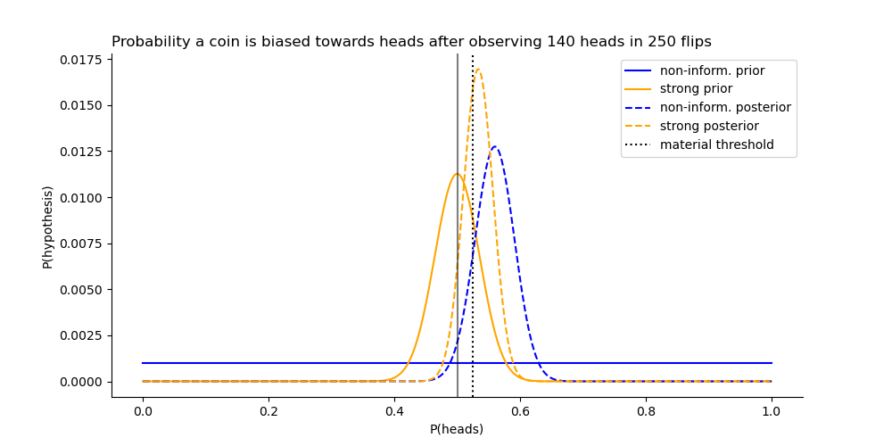

---
jupyter:
  jupytext:
    text_representation:
      extension: .md
      format_name: markdown
      format_version: '1.3'
      jupytext_version: 1.14.5
  kernelspec:
    display_name: Python [conda env:bayesian_stats]
    language: python
    name: conda-env-bayesian_stats-py
---

```python
import matplotlib.pyplot as plt
import numpy as np
import pandas as pd
from scipy import stats
```

# Binomial Distribution

Given a fair coin ($P(heads)=0.5$), what is the probability of observing 4 heads if you flip the coin 5 times?

```python
n = 5
p = 0.5

# Exactly 4 heads
p_4h = stats.binom.pmf(n=n, k=4, p=p)
print(f"{p_4h:.2%}")

# At most 4 heads
p_le_4h = stats.binom.cdf(n=n, k=4, p=p)
print(f"{p_le_4h:.2%}")
```

What is the probability a coin is materially biases towards heads ($P(heads) > 52.5\%$), given we flipped it 250 times and observed 140 heads?


```
P(p_heads > 52.5% | data)
Non-informative prior    : 86.16%
Strong prior coin is fair: 63.11%
```

```python
# Discrete set of hypotheses for the latent probability of a heads for the coin
n_hypos = 1001
p_heads = np.linspace(0,1,n_hypos)

# Prior distribution for probability of heads
# Non-informative prior
noninform_priors = np.ones(n_hypos)
noninform_priors /= noninform_priors.sum()

# Using a fairly strong prior that the coin is unbiased
strong_priors = stats.beta(a=100, b=100).pdf(p_heads)
strong_priors /= strong_priors.sum()

# Binomial likelihoods
likelihoods = stats.binom.pmf(k=140, n=250, p=p_heads)

# Posteriors
noninform_posteriors = noninform_priors * likelihoods
noninform_posteriors /= noninform_posteriors.sum()

strong_posteriors = strong_priors * likelihoods
strong_posteriors /= strong_posteriors.sum()

df = pd.DataFrame(
    dict(
        noninform_prior=noninform_priors,
        strong_prior=strong_priors,
        likelihood=likelihoods,
        noninform_posterior=noninform_posteriors,
        strong_posterior=strong_posteriors,
    ),
    index=pd.Series(p_heads, name="P(heads)")
)
```

```python
%matplotlib ipympl
fig, ax = plt.subplots(figsize=(10,5))
ax.plot(df.index, df.noninform_prior, label="non-inform. prior", color="blue")
ax.plot(df.index, df.strong_prior, label="strong prior", color="orange")
ax.plot(df.index, df.noninform_posterior, label="non-inform. posterior", color="blue", linestyle="--")
ax.plot(df.index, df.strong_posterior, label="strong posterior", color="orange", linestyle="--")
ax.axvline(x=0.5, color="black", alpha=0.5)
ax.axvline(x=0.525, color="black", linestyle=":", label="material threshold")
ax.spines[['right', 'top']].set_visible(False)
ax.set_title(
    "Probability a coin is biased towards heads after observing 140 heads in 250 flips",
    loc='left', 
    fontdict={'fontsize': 12}
)
ax.set_xlabel("P(heads)")
ax.set_ylabel("P(hypothesis)")
ax.legend()
```

```python
# P(p_heads > 52.5% | data)
print(f"Non-informative prior    : {df.noninform_posterior[df.index > 0.525].sum():.2%}")
print(f"Strong prior coin is fair: {df.strong_posterior[df.index > 0.525].sum():.2%}")
```

```python

```
